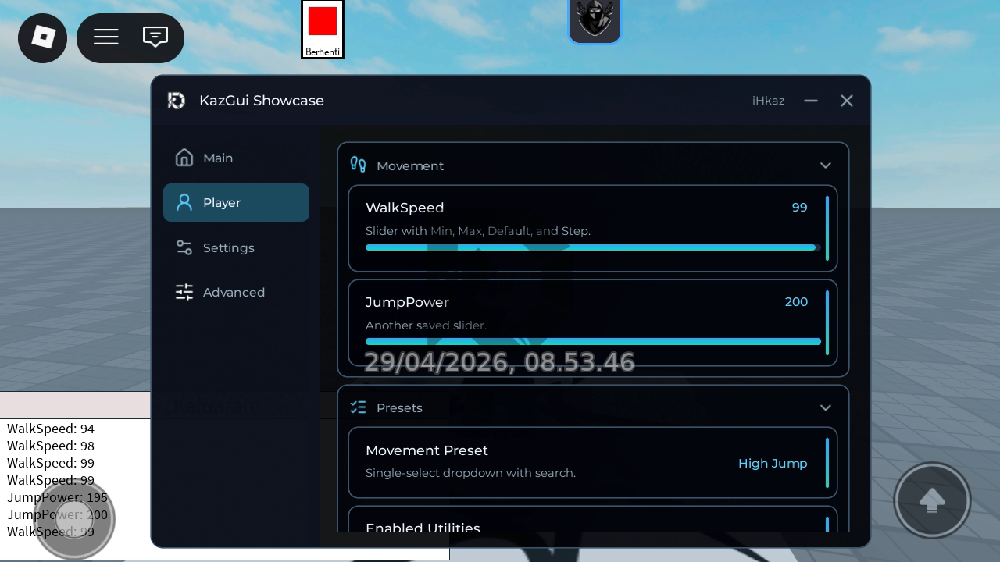
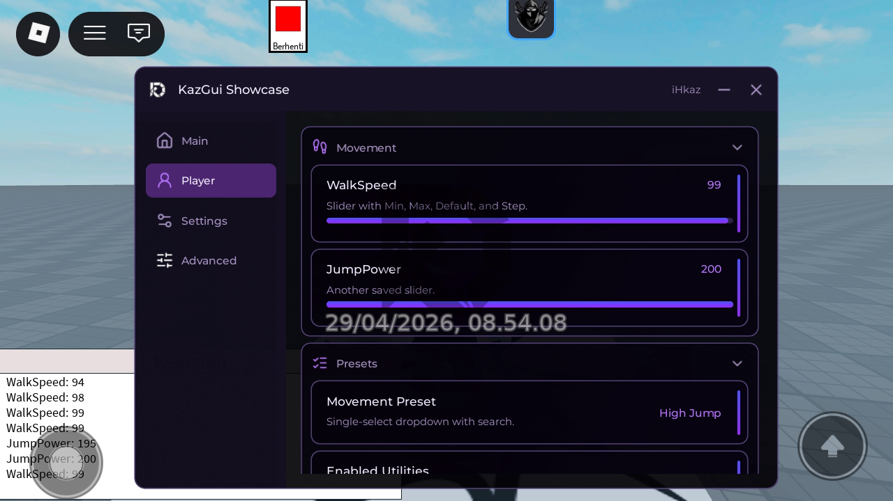
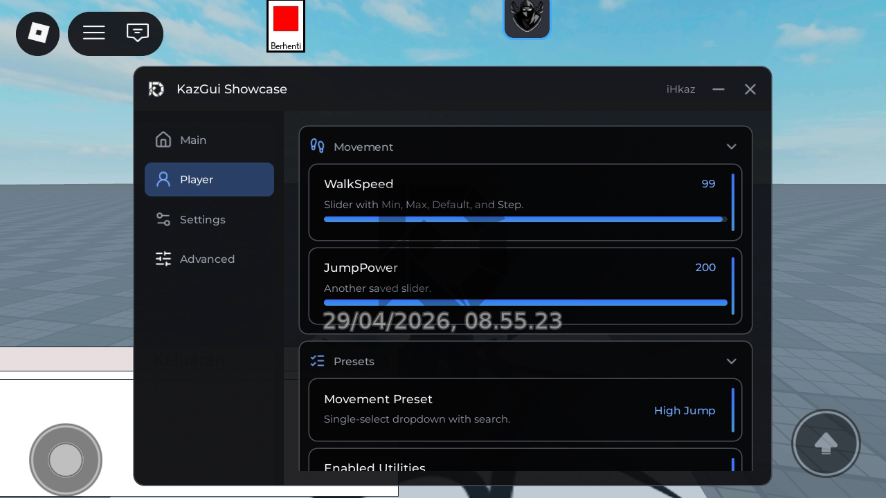
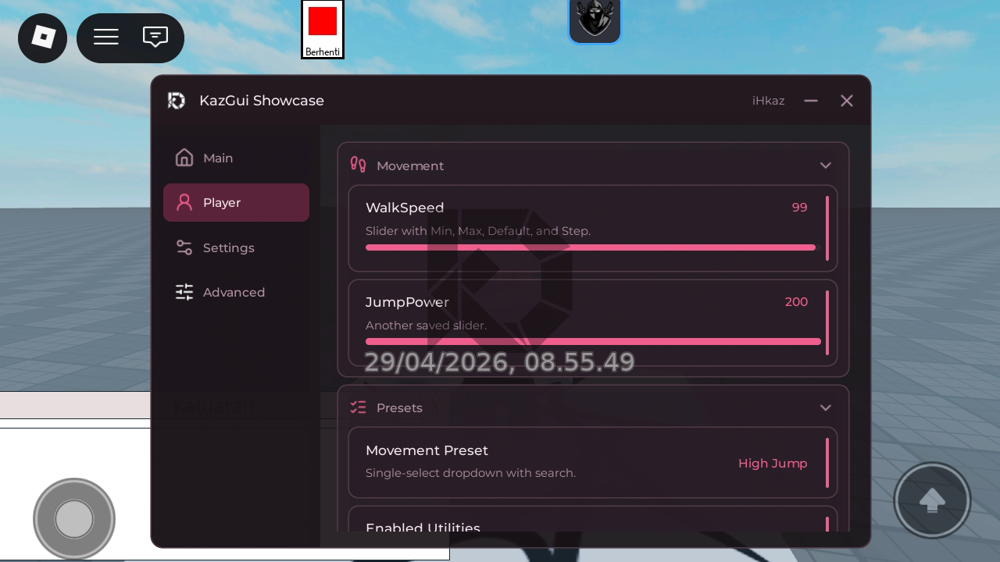
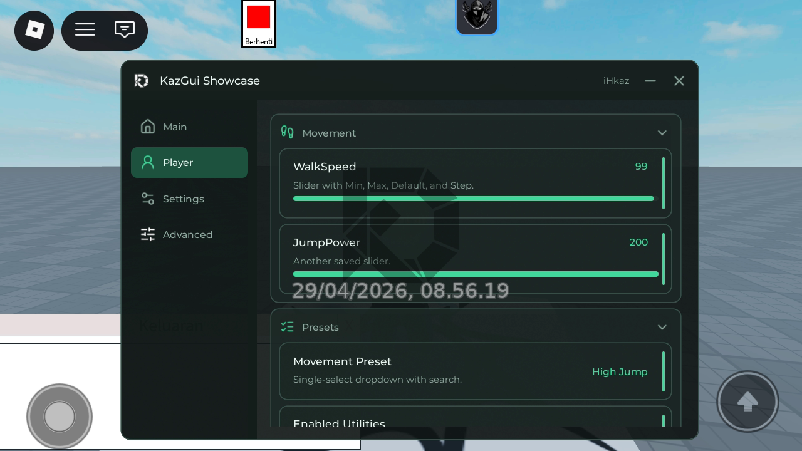
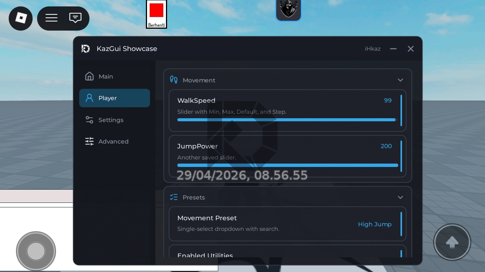

# KazGui

Roblox GUI library.


## Preview

<p align="center">
  
  
  
  
  
  
</p>


## Loader

```lua
local KazGui = loadstring(game:HttpGet("https://raw.githubusercontent.com/ihkaz/KazGuiLibrary/main/dist/KazGui.min.lua"))()
```

## Links

- [Documentation](DOCS.md)
- [Basic example](examples/basic.lua)
